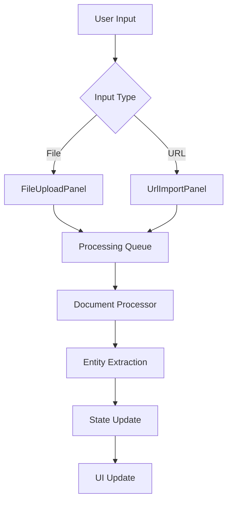
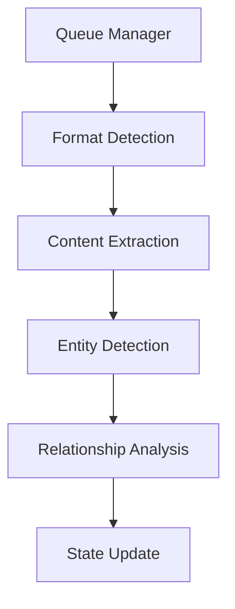

# UI Architecture Updates for UnstructuredTab

## Component Structure Changes

The UnstructuredTab component will be restructured to better handle document processing and entity management:

```
UnstructuredTab/
├── components/
│   ├── FileUploadPanel/
│   │   ├── FileDropZone.tsx
│   │   ├── FilePreview.tsx
│   │   └── FileTypeValidator.tsx
│   ├── UrlImportPanel/
│   │   ├── UrlInput.tsx
│   │   ├── UrlPreview.tsx
│   │   └── UrlValidator.tsx
│   ├── ProcessingStatus/
│   │   ├── ProgressIndicator.tsx
│   │   ├── StatusBadge.tsx
│   │   └── ErrorDisplay.tsx
│   └── EntityDisplay/
│       ├── EntityList.tsx
│       ├── EntityGraph.tsx
│       └── EntityFilter.tsx
├── hooks/
│   ├── useFileProcessing.ts
│   ├── useUrlProcessing.ts
│   ├── useEntityExtraction.ts
│   └── useProcessingQueue.ts
└── types/
    ├── processing.types.ts
    └── entity.types.ts
```

## State Management

### Processing Queue State
```typescript
interface ProcessingQueueState {
  queue: QueuedDocument[];
  processing: QueuedDocument | null;
  completed: ProcessedDocument[];
  failed: FailedDocument[];
}

interface QueuedDocument {
  id: string;
  type: 'file' | 'url';
  source: File | string;
  status: 'queued' | 'processing' | 'completed' | 'failed';
  progress: number;
  error?: string;
}
```

### Entity Management State
```typescript
interface EntityState {
  entities: Entity[];
  selectedEntity: Entity | null;
  filters: EntityFilter[];
  grouping: EntityGrouping;
  visualization: 'list' | 'graph';
}
```

## Data Flow

1. Document Input


2. Processing Pipeline


## Key Improvements

### 1. Enhanced File Handling
- Drag-and-drop support with visual feedback
- Multi-file upload queue management
- Progress tracking per file
- Automatic file type detection

### 2. URL Processing
- Enhanced validation with preview
- Automatic content type detection
- Metadata extraction
- Processing status tracking

### 3. Entity Management
- Hierarchical entity display
- Entity relationship visualization
- Filtering and sorting options
- Entity type categorization

### 4. Status Indicators
- Detailed progress tracking
- Error handling with retry options
- Activity log
- Processing stage indicators

## Component Communication

### Event Flow
```typescript
// Event handling between components
interface DocumentEvents {
  onFileSelect: (files: File[]) => void;
  onUrlSubmit: (url: string) => void;
  onProcessingComplete: (doc: ProcessedDocument) => void;
  onError: (error: ProcessingError) => void;
}

// Inter-component communication
interface ComponentCommunication {
  filePanel: DocumentEvents;
  urlPanel: DocumentEvents;
  processingStatus: StatusEvents;
  entityDisplay: EntityEvents;
}
```

## Performance Considerations

1. Chunked Processing
- Large file handling
- Streaming processing updates
- Background processing

2. UI Optimizations
- Virtualized lists for large datasets
- Lazy loading of entity details
- Debounced updates

3. State Management
- Efficient updates
- Cached processing results
- Optimistic UI updates

## Error Handling

1. User Feedback
- Clear error messages
- Recovery options
- Progress preservation

2. System Recovery
- Queue persistence
- Automatic retries
- State recovery

## Future Extensibility

1. Plugin Architecture
- Custom entity extractors
- Format-specific processors
- Visualization plugins

2. Integration Points
- External processing services
- Custom entity sources
- Third-party visualizations

## Development Guidelines

1. Component Development
- Maintain single responsibility
- Implement proper error boundaries
- Use TypeScript strictly

2. State Management
- Clear update patterns
- Predictable side effects
- Proper error propagation

3. Testing Strategy
- Component unit tests
- Integration tests
- End-to-end processing tests