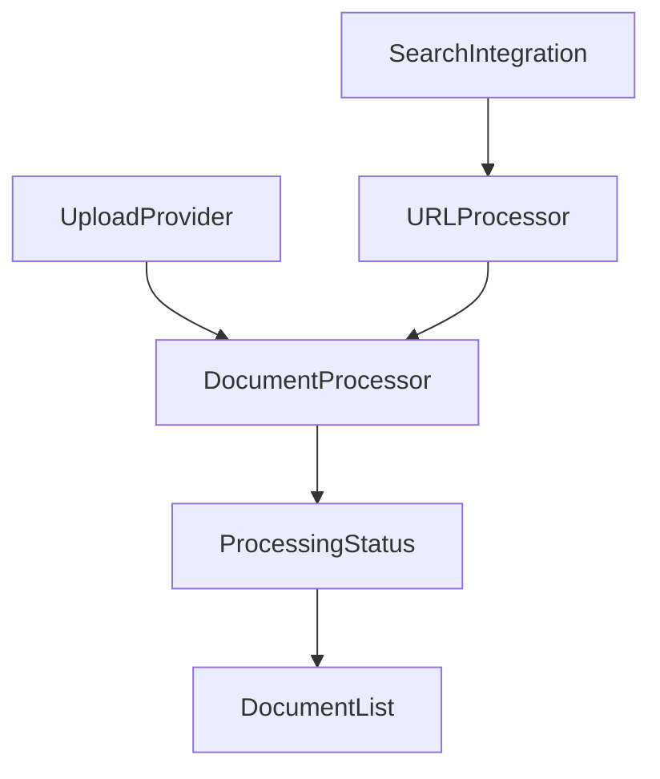

# Enhanced UI Architecture

## 1. Component Structure

### 1.1 Upload Components

```
UploadProvider/
├── LocalUpload/
│   ├── FileInput
│   └── DragDropZone
├── GDriveUpload/
│   ├── GDriveAuth
│   ├── FileBrowser
│   └── FileSelector
└── URLInput/
    ├── SingleURLInput
    ├── MultiURLInput
    ├── DomainInput
    └── SearchInput
```

### 1.2 Processing Pipeline Components

```
ProcessingPipeline/
├── FormatDetector
├── DocumentProcessor/
│   ├── MarkerConverter
│   ├── StructuredDataParser
│   └── EntityExtractor
├── URLProcessor/
│   ├── ContentFetcher
│   ├── DomainCrawler
│   └── SearchIntegration
└── ProcessingStatus
```

## 2. State Management

### 2.1 Document Context

```typescript
interface DocumentContext {
  documents: ProcessedDocument[];
  uploadQueue: QueuedDocument[];
  processingStatus: Record<string, ProcessingStatus>;
  addDocument(doc: File | URL): void;
  removeDocument(id: string): void;
  processDocument(id: string): Promise<void>;
}
```

### 2.2 Upload Context

```typescript
interface UploadContext {
  provider: 'local' | 'gdrive';
  isAuthenticated: boolean;
  uploadProgress: number;
  selectedFiles: File[];
  queuedURLs: string[];
  authenticate(): Promise<void>;
  uploadFiles(): Promise<void>;
  processURLs(): Promise<void>;
}
```

## 3. User Interface Flow

### 3.1 Document Upload Flow

1. User selects upload source (Local/GDrive/URL)
2. Based on source:
   - Local: Show drag-drop or file picker
   - GDrive: Show authentication then file browser
   - URL: Show URL input options
3. File processing status shown in ProcessingStatus component
4. Processed documents appear in DocumentList

### 3.2 URL Processing Flow

1. User enters URL(s) or domain
2. URL validation and preview
3. Optional search integration for finding related URLs
4. Processing status shown for each URL
5. Processed content added to DocumentList

## 4. Component Interactions

### 4.1 Data Flow



### 4.2 Event Handling

```typescript
// Upload Events
onFileSelect: (files: File[]) => void
onURLSubmit: (urls: string[]) => void
onGDriveSelect: (fileIds: string[]) => void

// Processing Events
onProcessingStart: (id: string) => void
onProcessingProgress: (id: string, progress: number) => void
onProcessingComplete: (id: string, result: ProcessedDocument) => void
onProcessingError: (id: string, error: Error) => void
```

## 5. UI States

### 5.1 Upload States

```typescript
type UploadState =
  | 'idle'
  | 'dragging'
  | 'selecting'
  | 'authenticating'
  | 'uploading'
  | 'processing'
  | 'error'
```

### 5.2 Document States

```typescript
type DocumentState =
  | 'queued'
  | 'uploading'
  | 'processing'
  | 'analyzing'
  | 'complete'
  | 'error'
```

## 6. UI Components Enhancement

### 6.1 File Upload UI

```typescript
interface UploadZoneProps {
  accept: string[];
  maxSize: number;
  multiple: boolean;
  onDrop: (files: File[]) => void;
}

interface GDriveButtonProps {
  onSelect: (fileIds: string[]) => void;
  allowedTypes: string[];
  maxFiles: number;
}
```

### 6.2 URL Input UI

```typescript
interface URLInputProps {
  mode: 'single' | 'multiple' | 'domain' | 'search';
  onSubmit: (urls: string[]) => void;
  validation?: URLValidationConfig;
}

interface SearchInputProps {
  engine: 'sonar' | 'tavily';
  onSearch: (query: string) => Promise<SearchResult[]>;
  onSelect: (urls: string[]) => void;
}
```

## 7. Error Handling

### 7.1 User Feedback

- Clear error messages for invalid files/URLs
- Progress indicators for long-running operations
- Preview capability before processing
- Ability to cancel ongoing operations

### 7.2 Error States

```typescript
interface ErrorState {
  type: 'upload' | 'process' | 'auth' | 'network';
  message: string;
  retryable: boolean;
  details?: any;
}
```

## 8. Accessibility Considerations

- Keyboard navigation for file selection
- Screen reader support for processing status
- ARIA labels for dynamic content
- Focus management during modal operations
- Loading states and progress indicators

## 9. Performance Optimization

### 9.1 Upload Optimization

- Chunk large file uploads
- Parallel processing of multiple files
- Progressive loading of GDrive files
- Caching of processed documents

### 9.2 UI Optimization

- Virtualized lists for large document sets
- Lazy loading of components
- Debounced search inputs
- Optimistic UI updates